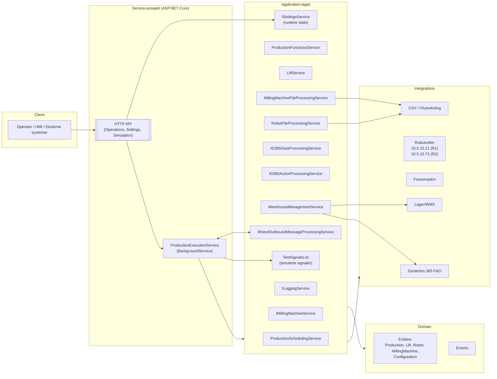
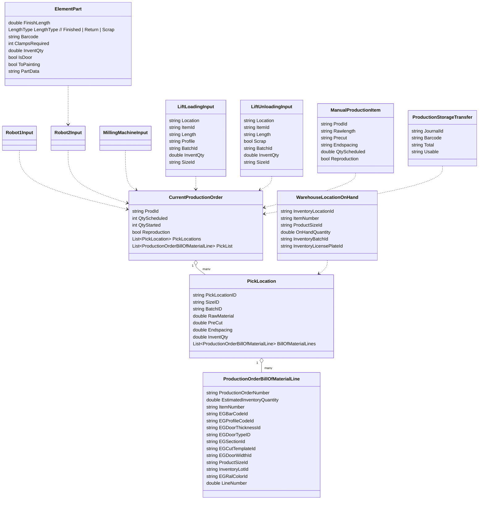

# LOB Garage Door – Produksjonskontroller

Styrer produksjonen av garasjeporter på fabrikkgulvet: plukk/lagring, løfteanlegg, fresecelle og to robotceller.
Systemet integrerer mot Dynamics 365 F&O (produksjonsordre, BOM, lager), samt roboter og fres via signaler og CSV-filer.
Kjøringen orkestreres av en ASP.NET Core-basert bakgrunnstjeneste, støttet av et HTTP API for operatørstyring.

**Status:** Utkast – oppdatert med verifiserte kilder fra denne gjennomgangen.  
**Bekreftet grunnlag (filer gjennomgått):**

Application/Services/ProductionExecutionService.cs

LOBGarageDoorProductionControllerService/Controllers/OperationsController.cs

LOBGarageDoorProductionControllerService/Controllers/SettingsController.cs

LOBGarageDoorProductionControllerService/Controllers/SimulationController.cs

Domain/Entities/Lift/LiftLoadingInput.cs, LiftUnloadingInput.cs

Domain/Entities/Production/ManualProductionItem.cs, ProductionStorageTransfer.cs

Application/Interfaces/ISettingsService.cs

Application/General/TestSignalsList.cs

Program.cs (test/debug-støtte)


## Innhold

Arkitektur

Teknologier og avhengigheter

Kjerne domenemodell

Hovedflyter

API – Endepunkter

Installasjon & kjøring

Konfigurasjon

Database

Logging & overvåkning

Tester & CI/CD

Feilsøking (kjente fallgruver)

Veikart / mangler

Bilag: Signaler som overvåkes

Bilag: Forretningsregler

Bilag: DTOer brukt i API

Eksempelflyt


## Arkitektur



### Roller og ansvar (utdrag)


#### `ProductionExecutionService`
Sentralt orkestreringsloop (2s intervall).  
- Leser state fra `ISettingsService`  
- Henter produksjonsordre (manuell/automatisk)  
- Genererer CSV-filer for Robot1/Robot2 og fresecelle  
- Håndterer el-signal-synkronisering via `IRobotOutboundMessageProcessingService`  

➡️ Koordinerer hele produksjonsflyten – inkludert:  
- `WarehouseManagementService`  
- `RobotFileProcessingService`  
- `MillingMachineFileProcessingService`  

#### `HTTP API`
Eksponerer **Operations**, **Settings** og **Simulation** kontrollere.  
- Støtter operatørkommandoer  
- Statusflagg  
- Manuell lasting/lossing  
- Testverdier i utviklingsmodus  

#### `Runtime state (Settings)`
Lagres i minne via `ISettingsService`, tilgjengelig via nøkkelbasert API.  

- **Boolean flagg:**  
  - `StartAutomaticExecution`  
  - `DoorProductionInactive`  
  - m.fl.  

- **Lister:**  
  - `ManualProductionItems`  
  - `LiftLoadingKassettList`  
  - `ProductionStorageTransferList`  
  - m.fl.  

#### `Testsignaler`
- `TestSignalsList` gir simulerte signaler for utvikling og test  
- Styrt via `SimulationController`  

**Typiske signaler:**  
- `DOF_OkToSendNewCsvFilesRob1`  
- `DOF_OrderDone`  
- `strLiftCommand`  
- `numElementLength`  


#### `WarehouseManagementService`
Styrer produksjonslageret, tray-/heislogikk og D365-integrasjoner for overføringsjournaler.  
- Velger plukklokasjoner  
- Validerer lagerbeholdning  
- Genererer `Robot1Input` for lasting og lossing  

Bruker `GetPickLocationsAsync(...)` for optimal råvareutnyttelse og segmentering.  

#### `RobotFileProcessingService`
Genererer CSV-filer for **Robot1** og **Robot2** basert på produksjonsdata og plukk-informasjon.  

- Skriver til konfigurerte filbaner (via `AppEnvironmentConfig`)  
- Laster opp via FTP  
- Håndterer også opprydding og parsing av kasserte CSV-filer  


#### `MillingMachineFileProcessingService`
Skriver `.lbs`-filer for fresecelle.  

- Basert på data fra `D365DataProcessingService`  
- Genereres detaljert fresedata:  
  - `O:CIRCLE`, `O:CUT`, `O:MACRO`, `C:` (klemmer), osv.  

Støtter:  
- Høydekompensasjon (`HeightCompensationMillingFile`)  
- Konfliktfri klemmeplassering  

#### `D365-integrasjon`
- **Ordrehåndtering:**  
  - `StartProduction(...)`  
  - `CreatePurchaseOrder(...)`  

- **Lagerstyring:**  
  - `UpdateWMSLocation(...)`  
  - `GetPickList(...)`  
  - `AdjustOnHandQty(...)`  

- **Journalføring:**  
  - `CreateTransferJournal(...)`  
  - `UpdateTransferJournal(...)`  
  - `PostTransferJournal(...)`  

#### `Robot-integrasjon`
- **CSV-generering:** via `RobotFileProcessingService`  
- **Direkte signal-/variable-skriving:** via `IRobotOutboundMessageProcessingService`  
- Krever *mastership per IP* for å sette verdier  


## Teknologier og avhengigheter

### .NET / ASP.NET Core
Systemet er bygget på .NET 7 med ASP.NET Core.  
Brukes både til:  

- Hosted Service (`ProductionExecutionService`)  
- HTTP API (`OperationsController`, `SettingsController`, `SimulationController`)  

### Dynamics 365 F&O
Brukes til:  

- **Ordrehåndtering:**  
  - `StartProduction(...)`  
  - `CreatePurchaseOrder(...)`  

- **Lagerstyring:**  
  - `UpdateWMSLocation(...)`  
  - `GetPickList(...)`  
  - `AdjustOnHandQty(...)`  

- **Journalføring:**  
  - `CreateTransferJournal(...)`  
  - `PostTransferJournal(...)`  

Integrasjonen gjøres via `ID365DataProcessingService` og `ID365ActionProcessingService`.  

### WMS (Warehouse Management System)
Systemet kommuniserer med WMS for:  
- Tray-posisjoner  
- Beholdningskontroll  
- Retur-lokasjoner  


### CSV / filutveksling (Robot)
- Robot1 og Robot2 mottar `.csv`-filer  
- Filene genereres av `RobotFileProcessingService`  
- Eksempelbaner: \\lob-file01\Produksjon\515\csvRob1\, csvRob2\
- Filene overføres via **FTP** til IP-adressene:  
  - **Robot1 →** `10.5.15.21`  
  - **Robot2 →** `10.5.15.73`  


### Fresemaskin – .lbs-filer
- Fresecellen bruker et proprietært tekstformat (.lbs) 
- Filene inneholder kommandokoder som O:CIRCLE, O:CUT, O:MACRO, C: osv.  
- Genereres av MillingMachineFileProcessingService
- Format følger engelsk lokaliseringsstandard (en-GB) for desimaler
- Lagringsbane: \\lob-file01\Produksjon\515\FomCam\


### Digitale IO-signaler
- Roboter og fres samhandler via digitale signaler (boolske)  
- Håndteres gjennom `IRobotOutboundMessageProcessingService`  
- Eksempel:  
  - `DOF_OkToSendNewCsvFilesRob1`  
  - `DOF_ConfirmFeederReturnInPos`  


### Runtime-konfigurasjon og state
Systemet benytter to lag med konfigurasjon:  

#### `AppEnvironmentConfig` (via `IOptions<>`)
- Inneholder statiske verdier som:  
  - `Testing` → aktiverer simulasjonsmodus  
  - `FilePaths` → filbaner til CSV og LBS  
  - `Logging.Level` → loggnivå  
- Konfigureres i `appsettings.json`  

#### `ISettingsService`
- Holder runtime-state i minne  
- Tilgjengelig via nøkkel-streng (eks: `"ManualProductionItems"`)  
- Brukes til både lister og flagg (`bool`, `int`, `DateTime`, `List<T>`)  


### Testmiljø og simulering
- Når `AppEnvironmentConfig.Testing == true`:  
  - Signaler rutes til `TestSignalsList`  
  - `SimulationController` åpnes for manuell verdi-endring  
  - Ingen fysisk IO sendes til roboter eller fres  


### Egendefinerte applikasjonstjenester

| Interface                              | Rolle                               |
|----------------------------------------|-------------------------------------|
| `IRobotOutboundMessageProcessingService` | Signalutveksling med roboter        |
| `IRobotFileProcessingService`           | CSV-generering for Robot1/2         |
| `IMillingMachineFileProcessingService`  | `.lbs`-filer for fres               |
| `IWarehouseManagementService`           | Lagerlogikk og journalhåndtering    |
| `IProductionFunctionsService`           | Statusoppdatering i D365            |
| `ID365DataProcessingService`            | Lese operasjoner fra D365           |
| `ID365ActionProcessingService`          | Skrive operasjoner til D365         |
| `ISettingsService`                      | Runtime state-lagring               |
| `ILoggingService`                       | Logging av hendelser (sink ukjent)  |


## Kjerne domenemodell



## Hovedflyter

Systemet støtter to produksjonsmodi: **manuell** og **automatisk**.  
En sentral bakgrunnstjeneste (`ProductionExecutionService`) orkestrerer prosessen i tre hovedfaser, med 2 sekunders intervall.  

### A) Valg av produksjon

#### Robotklar-sjekk
- Utføres ved å lese signalet `DOF_OkToSendNewCsvFilesRob1` (R1: `10.5.15.21`).  
- I testmiljø leses verdien fra `TestSignalsList.DOF_OkToSendNewCsvFilesRob1`.  

#### Manuell produksjon
- Dersom `Settings["ManualProductionItems"]` inneholder batcher →  
  `GetManualProduction()` henter data fra D365 og WMS.  
- DTO: `ManualProductionItem`  

#### Automatisk produksjon
- Hvis `Settings["StartAutomaticExecution"] == true` og robot er klar →  
  `GetProduction()` henter neste tilgjengelige ordre.  
- Ved manglende lagerkvantum logges:  
  *"Not enough sections... Please refill storage."*  
  - `skipCount` økes.  


### B) Kjøre en ordre (`ProcessProduction`)

- Ordrestatus oppdateres i D365 (`ProductionFunctionsService.UpdateProductionStatus`).  
- For hver `PickLocation`:  
  - Lagerlokasjon identifiseres (`WarehouseManagementService.GetPickLocationsAsync(...)`)  
  - `LiftService.CreateLiftString(...)` genererer løftekommando  
  - `RobotInput` bygges og skrives til CSV via `RobotFileProcessingService.CreateRobot1File(...)`  


### C) Fresecelle og Robot2 (`ProcessMillingCellData`)

#### Signal-synkronisering
- Krever `DOF_OkToSendNewCsvFilesRob2 == true` (eller testsignal).  

#### Panel-deling
- Råmaterialet splittes i `ElementPart` med regler for **Finished | Return | Scrap**.  

#### Kasettregler
- Egne metoder for precut og klemmer.  

#### Artikkelrester
- ≥ 2400 mm → retur  
- 1200–2399 mm → retur  
- < 1200 mm → skrot  

#### Dør fra rest (opsjonelt)
- Hvis `Settings["DoorProductionInactive"] == false` og restlengde er 754–2399 mm →  
  ny dørordre i D365.  

#### Filskriving
- Fres: `MillingMachineFileProcessingService.CreateMillingFile(...)` → `.lbs`  
- Robot2: `RobotFileProcessingService.CreateRobot2File(...)` → `.csv`  

### D) Støtteflyter og vedlikehold

#### Løfteoperasjoner
- Manuell lasting/lossing (`LiftLoadingInput`, `LiftUnloadingInput`) håndteres via API og state.  
- Etterpå genereres `Robot1File` for heis.  

### Produksjonslagerpåfylling
- `WarehouseManagementService.CheckProductionStorageInventoryAsync()` identifiserer lokasjoner < 5 stk.  
- Oppretter overføringsjournal i D365 og genererer flyttinger.  

#### ReplenishStock (lagerflytting via heis/palleplass)
**Scenarier:**  
- `loading` : Flytting til lager via heis → Robot1 CSV  
- `unloading` : Utlasting fra heis → Robot1 CSV  
- `LiftLoadingKassettList` : Kassett lasting → Robot1 CSV  
- `productionStorage` : Fullfører journal og poster i D365  

➡️ Bruker `ProductionStorageTransfer` fra state.  

#### Runtime state
- Alle operasjoner lagres midlertidig i `ISettingsService`  
- Initielt må alle lister være tomme for å unngå `NullReferenceException`.  

#### Robotvariabler
- `WarehouseManagementService.UpdateStoragePickPositionAsync()` leser `nSourceStorage`, `nTargetStorage` etc. fra robot (R1) og synkroniserer med faktiske lagerkvanta i D365.  
- Krever `MastershipRequest` for å skrive verdier tilbake.  


## API – Endepunkter

Systemet eksponerer tre hovedkontrollere: `Operations`, `Settings`, og `Simulation`.  
Alle endepunkter er HTTP-baserte (JSON inn/ut) og benytter `ISettingsService` til runtime state-håndtering.

---

### 🧭 OperationsController (`/Operations`)

---

## 🛠️ OperationsController (`/Operations`)

| Metode | Rute                    | Body                                | Retur  | Beskrivelse |
|--------|--------------------------|-------------------------------------|--------|-------------|
| **POST** | `/CheckReturnFeeder`     | `bool`                              | `bool` | Setter `CheckReturnFeeder`. Tjenesten prosesserer retur-feeder ved neste poll. |
| **POST** | `/ManualLoadingLift`     | `List<LiftLoadingInput>`            | –      | Legger manuelle løfte-innlastinger i state. Prosesseres av `WarehouseManagementService.ReplenishStockAsync(...)`. |
| **POST** | `/LoadingLiftKassett`    | `List<LiftLoadingInput>`            | –      | Legger kassett-innlastinger. Brukes til standardisert produksjon. |
| **POST** | `/ManualUnloadingLift`   | `List<LiftUnloadingInput>`          | –      | Legger manuelle utlastinger. Håndteres i bakgrunn via `RobotInput`. |
| **GET**  | `/GetFeedback`           | –                                   | `string` | Returnerer konsolidert loggtekst. |
| **POST** | `/ManualProduction`      | `List<List<ManualProductionItem>>` | –      | Legger manuell produksjon i kø (`ManualProductionItems`). |
| **POST** | `/ProductionStorageTransfer` | `ProductionStorageTransfer`      | –      | Brukes til overføring mellom lager og produksjonslokasjon. Prosesseres av `ReplenishStockAsync(..., productionStorage: true)`. |

---

Eksempel: `/Operations/ManualProduction`

```json
[
  [
    {
      "ProdId": "116024",
      "Rawlength": "3508",
      "Precut": "2850",
      "Endspacing": "100",
      "LineNumber": "2",
      "Location": "K01AA01",
      "Port": "Port1",
      "Reproduction": false,
      "QtyScheduled": 3,
      "QtyStarted": 0
    }
  ]
]
```

Eksempel: /Operations/ManualLoadingLift
```json
[
  {
    "Location": "LIFT1",
    "ItemId": "200050",
    "ItemName": "Profil A",
    "Length": "2600",
    "Endspacing": "50",
    "Profile": "ELEGANT",
    "Select": true,
    "BatchId": "B-2025-0910",
    "InventQty": 5.0,
    "SizeId": "6000"
  }
]

```

Eksempel: /Operations/ManualUnloadingLift
```json
[
  {
    "Location": "LIFT2",
    "ItemId": "113798",
    "ItemName": "Sprosse B",
    "Length": "1800",
    "Profile": "MODERN",
    "Select": true,
    "Scrap": false,
    "BatchId": "B-2025-0905",
    "InventQty": 1.0,
    "SizeId": "5240"
  }
]
```

Eksempel: /Operations/ProductionStorageTransfer
```json
{
  "JournalId": "TRX-142076",
  "Barcode": "113798-5240",
  "Total": "5",
  "Usable": "3"
}
```

### ⚙️ SettingsController (`/Settings`)

| Metode | Rute                     | Body | Retur | Effekt |
|--------|---------------------------|------|-------|--------|
| **POST** | `/StartStop`              | `bool` | `bool` | Starter eller stopper automatisk produksjon. |
| **GET**  | `/StartStop`              | –    | `bool` | Leser verdien for `StartAutomaticExecution`. |
| **POST** | `/LiftInactive`           | `bool` | `bool` | Setter `LiftInactive` (ikke i aktiv bruk). |
| **GET**  | `/LiftInactive`           | –    | `bool` | Leser `LiftInactive`. |
| **POST** | `/DoorProductionInactive` | `bool` | `bool` | Slår dør fra restlengde-produksjon på/av. |
| **GET**  | `/DoorProductionInactive` | –    | `bool` | Leser status. |

---


### 🧪 SimulationController (`/Simulation`) – kun test

| Metode | Rute                              | Body    | Retur   | Beskrivelse              |
|--------|------------------------------------|---------|---------|--------------------------|
| **GET**  | `/VariableValue/{variable}`        | –       | `double` | Leser numerisk testvariabel. |
| **POST** | `/VariableValue/{variable}`        | `double` | –       | Setter numerisk testvariabel. |
| **GET**  | `/StringVariableValue/{variable}`  | –       | `string` | Leser strengvariabel. |
| **POST** | `/StringVariableValue/{variable}`  | `string` | –       | Setter strengvariabel. |
| **GET**  | `/SignalValue/{signal}`            | –       | `bool`   | Leser boolsk testsignal. |
| **POST** | `/SignalValue/{signal}`            | `bool`   | –       | Setter boolsk testsignal. |

---


Eksempel: Sett DOF_OkToSendNewCsvFilesRob1 til true
curl -X POST http://<host>/Simulation/SignalValue/DOF_OkToSendNewCsvFilesRob1 \
-H "Content-Type: application/json" -d true

📌 Merk:

- Alle API-operasjoner interagerer med `ISettingsService`.  
- Listebaserte nøkler må initieres med tomme lister ved oppstart.  
- `WarehouseManagementService.ReplenishStockAsync(...)` og `CheckProductionStorageInventoryAsync()`  
  er kjerneprosesser bak mange av disse API-endepunktene.  


## Installasjon & kjøring

> 🛠 Status: Delvis kjent – `AppEnvironmentConfig` er delvis kartlagt; `Program.cs` (oppstart) mangler fortsatt.

> Under er generiske og realistiske steg, basert på analyserte filer.

### 📦 Krav

- [.NET SDK 7.0+](https://dotnet.microsoft.com/download)  
- Tilgang til produksjonsnettverket og IP-er:  
  - Robot1: `10.5.15.21`  
  - Robot2: `10.5.15.73`
- Tilkobling mot D365 og WMS må være konfigurert i `appsettings.json`

### 🧪 Lokalt testmiljø

- Sett `AppEnvironmentConfig.Testing = true`  
- Bruk `SimulationController` til å sette testverdier og signaler manuelt
- Ingen faktiske signaler sendes

### 🚀 Kjøre lokalt

```bash
dotnet restore
dotnet build
dotnet run --project LOBGarageDoorProductionControllerService
```
⚙️ Service-installasjon (Windows)

Ukjent – krever videre informasjon om Program.cs og eventuell Windows-tjeneste-oppsett
Kan kreve bruk av sc.exe eller nssm


## Konfigurasjon
Systemet benytter en kombinasjon av statisk konfigurasjon (`AppEnvironmentConfig`) og runtime-state (`ISettingsService`) for å styre kjøringen.  

### 📂 AppEnvironmentConfig
Konfigureres via `appsettings.json` og injiseres via `IOptions<AppEnvironmentConfig>`.  
Brukes av flere sentrale tjenester, bl.a.:  
- `RobotFileProcessingService`  
- `MillingMachineFileProcessingService`  
- `ProductionExecutionService`

Eksempel appsettings.json

```json
{
  "AppEnvironmentConfig": {
    "Testing": true
  },
  "D365": {
    "BaseUrl": "<ukjent>",
    "Tenant": "<ukjent>",
    "ClientId": "<ukjent>",
    "ClientSecret": "<ukjent>"
  },
  "WMS": {
    "BaseUrl": "<ukjent>"
  },
  "FilePaths": {
    "Robot1CsvOut": "<ukjent>",
    "Robot2CsvOut": "<ukjent>",
    "MillingCsvOut": "<ukjent>"
  },
  "Logging": {
    "Level": "Information"
  }
}
```
📌 Fyll ut <ukjent> med miljøspesifikke verdier (eks: produksjons-URL, hemmeligheter, filstier)

### Kjente felter

| Felt                     | Type   | Beskrivelse |
|---------------------------|--------|-------------|
| `Testing`                 | bool   | Aktiverer testmodus – signaler simuleres via `TestSignalsList` |
| `FilePaths.Robot1CsvOut`  | string | Output-mappe for Robot1 CSV-filer |
| `FilePaths.Robot2CsvOut`  | string | Output-mappe for Robot2 CSV-filer |
| `FilePaths.MillingCsvOut` | string | Output-mappe for frese `.lbs`-filer |
| `D365.BaseUrl`            | string | Base-URL til D365 |
| `D365.Tenant`             | string | Azure AD tenant-ID |
| `D365.ClientId`           | string | App-registrering for D365-integrasjon |
| `D365.ClientSecret`       | string | Klient-hemmelighet for D365-app |
| `WMS.BaseUrl`             | string | WMS-integrasjonens base-URL |
| `Logging.Level`           | string | Loggnivå (`Information`, `Warning`, `Error`, etc.) |

📌 Merk
- Alle filbaner peker typisk til: \\lob-file01\Produksjon\515\ eller 515-Test\ avhengig av Testing == true.


### ISettingsService – runtime state (brukte nøkler)

En nøkkelbasert in-memory key-value store brukt til å lagre produksjonens nåtilstand.  
API-endepunkter og `ProductionExecutionService` leser/skriver her kontinuerlig.  


#### 🔘 Kjent nøkler og datatyper

##### Boolean-flagg
| Nøkkel                   | Beskrivelse |
|---------------------------|-------------|
| `StartAutomaticExecution` | Aktiverer automatisk kjøring |
| `LiftInactive`            | Slår av heisen midlertidig |
| `DoorProductionInactive`  | Slår av dør fra rest-funksjon |
| `CheckReturnFeeder`       | Behandler returfeeder ved neste poll |
| `ProductionHasStarted`    | Internt flagg for pågående kjøring |

---

##### ⏱️ Tidsstempler og tellere
| Nøkkel                 | Type     | Beskrivelse |
|-------------------------|---------|-------------|
| `skipCount`             | int     | Antall hoppede ordre grunnet lagermangel |
| `skipCountUpdated`      | DateTime | Når `skipCount` sist ble endret |
| `ProductionCycleStart`  | DateTime | Starttid for nåværende produksjonssyklus |
| `ProductionStartTime`   | DateTime | Når produksjonen faktisk startet |
| `NumberOfDoors`         | int     | Antall dører produsert |

---

####D# 📑 Listebaserte nøkler (må initieres!)
⚠️ Alle må settes til `new List<>()` ved oppstart, ellers `NullReferenceException`.  

| Nøkkel                      | Type                                |
|------------------------------|-------------------------------------|
| `ManualProductionItems`      | `List<List<ManualProductionItem>>` |
| `ManualLiftLoadingList`      | `List<LiftLoadingInput>`            |
| `LiftLoadingKassettList`     | `List<LiftLoadingInput>`            |
| `ManualLiftUnloadingList`    | `List<LiftUnloadingInput>`          |
| `ProductionStorageTransferList` | `List<ProductionStorageTransfer>` |
| `signalsToMonitor`           | `List<RobotSignal>`                 |

---

 Eksempel: Initiering i oppstart (pseudo-kode)

```csharp
_settingsService.SetSetting("ManualProductionItems", new List<List<ManualProductionItem>>());
_settingsService.SetSetting("signalsToMonitor", new List<RobotSignal>());
```
---

⚠️ Fallgruver
- Hvis noen liste-nøkler ikke er initialisert → får man `NullReferenceException` ved første kall til `GetSetting<List<T>>()`.  
- `LiftInactive` og `DoorProductionInactive` kan være misvisende om de ikke brukes i praksis.  


### Standard signalsToMonitor (fra ProductionExecutionService)

| Robot | IP         | Signaler |
|-------|------------|----------|
| **R1** | 10.5.15.21 | DOF_ConfirmFeederReturnInPos, DOF_ActiveMessages, DOF_Port1Start, DOF_Port2Start, DOF_Port3Start, DOF_UpdatePositionData, DOF_ConfirmLeaveElement, DOF_SendLift1Command, DOF_SendLift2Command |
| **R2** | 10.5.15.73 | DOF_ConfirmLeaveFeederOut, DOF_PrintLabel, DOF_ActiveMessages, DOF_OrderStarted, DOF_OrderDone, DOF_MeasurementsConfirmed, DOF_ConfirmLeaveScrap |

> Disse signalene overvåkes kontinuerlig av `ProductionExecutionService` for å koordinere el-signal-synkronisering og filoverføring.


## Database

> 🔍 Status: Ukjent

Systemet ser ikke ut til å benytte en lokal database eller Entity Framework Core for vedvarende lagring.  
All runtime-state håndteres i minne gjennom `ISettingsService`.

### Dynamiske kilder:
- **D365 F&O**: Primærkilde for produksjonsordre, lager og journalføring
- **WMS**: Tray-lokasjoner og beholdning
- **Runtime-state**: Lagres midlertidig i `ISettingsService` (in-memory)

### Foreløpig vurdering:
- Det finnes **ingen observerte `DbContext`-klasser**
- **Ingen migrasjoner eller seed-data** er analysert
- Logging skjer gjennom `ILoggingService`, men hvor data havner (fil, DB, ELK) er fortsatt ukjent

📌 Hvis systemet faktisk bruker EF Core i bakgrunnen, bør dette dokumenteres når filene er tilgjengelige.


## Logging & overvåkning

Systemet benytter `ILoggingService` til å skrive loggmeldinger gjennom hele kjøringen.  
Alle hovedtjenester (produksjon, lager, filskriving, signaler) logger hendelser og feil via `LogAsync(...)`.


### Loggingnivå

Loggnivå settes via `appsettings.json`:

```json
"Logging": {
  "Level": "Information"
}
```
Tilgjengelige nivåer: Trace, Debug, Information, Warning, Error, Critical


### 📍 Hvor logges det?
- **Status: Ukjent**  
  `ILoggingService` sin konkrete implementasjon er ikke analysert.  

Derfor er det ukjent om loggingen faktisk:  
- Skrives til fil, console, eller ekstern tjeneste (f.eks. Seq, ELK)  
- Bruker strukturert logging eller ren tekst  
- Er persistert eller bare i minnet  

### 📂 Tilgang til logger
Systemet eksponerer en enkel logg via API:  

| Endpoint                  | Metode | Retur   | Beskrivelse |
|---------------------------|--------|---------|-------------|
| `/Operations/GetFeedback` | GET    | string  | Returnerer tekstbasert loggutdrag fra siste kjøring |

Denne loggen vises ofte i HMI eller webklient som operatørtilbakemelding.  

## 💡 Forbedringsforslag
- Innføre strukturert logging (eks: `Serilog` med file sink og rolling log)  
- Legge til `LogEventId`, `Exception` og `LogContext` i `ILoggingService`  
- Vurdere eksport til observabilitetssystemer (ELK, Seq, Azure Monitor)  


### 📌 Merk
Systemet mangler fullstendig dokumentert **observabilitetsstrategi**.  

## Tester & CI/CD

> 🔍 Status: Delvis kartlagt

Systemet inneholder ingen observerbare testprosjekter eller CI/CD-definisjoner i kildekoden per nå.  
Det er heller ingen dokumentert teststrategi eller dekning.


### Testvennlig arkitektur

Til tross for manglende testprosjekter, er arkitekturen generelt **testvennlig**:
- Tjenester bruker **avhengighetsinjeksjon (DI)** → mocks kan enkelt injiseres
- Konfigurasjon via `IOptions<AppEnvironmentConfig>` er enkel å overstyre i test
- `SimulationController` + `TestSignalsList` muliggjør trygge integrasjonstester uten fysisk maskinvare


### Testmiljø

Når `AppEnvironmentConfig.Testing = true`:
- Systemet aktiverer `SimulationController`
- Svar simuleres med `TestSignalsList`
- Ingen faktiske signaler sendes til roboter eller fres


### Mangler

- ❌ Ingen `*.Tests.csproj`-filer observert
- ❌ Ingen `xUnit`, `NUnit`, `MSTest`-referanser funnet
- ❌ Ingen kode for mocking eller test helpers
- ❌ Ingen dokumentert teststrategi


### CI/CD-status

> ❌ Ingen `.github/workflows`, `azure-pipelines.yml` eller lignende er funnet i repoet.

Det er ukjent hvordan systemet:
- Bygges
- Testes
- Deployeres til test- eller produksjonsmiljø


### Forslag til forbedringer

- ✳️ Opprett dedikert `*.Tests`-prosjekt med xUnit
- ✳️ Skriv enhetstester for kritiske tjenester:
  - `ProductionExecutionService`
  - `WarehouseManagementService`
  - `RobotFileProcessingService`
- ✳️ Legg inn GitHub Actions for:
  - Build
  - Test
  - Dekning
- ✳️ Aktiver strukturerte `integration tests` med `TestEnvironment = true`


📌 Merk: Systemet har god testbarhet, men **mangler praktisk testimplementasjon og automatisert byggkjede.**

## Feilsøking (kjente fallgruver)

Denne seksjonen beskriver vanlige problemer og hvordan de kan identifiseres og løses.

### 🚫 Automatisk kjøring starter ikke

**Symptom:** Produksjonen starter ikke automatisk selv om batch er tilgjengelig.

✅ Sjekk:

- `Settings["StartAutomaticExecution"] == true`?
- Signal `DOF_OkToSendNewCsvFilesRob1` == true?  
  → IP: `10.5.15.21`  
  → I testmiljø: `TestSignalsList.DOF_OkToSendNewCsvFilesRob1`
- Logger viser:  
  _"Waiting for robot1 ready signal..."_

### 📭 Robot2 eller fresefil ikke generert

**Symptom:** Ingen CSV/LBS-filer blir skrevet for frese og/eller Robot2.

✅ Sjekk:

- `DOF_OkToSendNewCsvFilesRob2 == true`? (R2: `10.5.15.73`)
- `TestSignalsList.DOF_OkToSendNewCsvFilesRob2` satt til `true` i test?
- `ProcessMillingCellData` ble kalt etter Robot1?
- Logger viser:  
  _"Waiting for Robot2 ready signal..."_

### 📉 Ikke nok seksjoner i lager

**Symptom:** Automatisk produksjon hopper over batcher.

✅ Sjekk:

- Logger viser: _"Not enough sections… Please refill storage."_
- `skipCount` øker kontinuerlig
- Sjekk `WarehouseManagementService.CheckCapacityLiftAsync(...)`


### 💥 Null-lister i runtime state

**Symptom:** Systemet feiler med `NullReferenceException` ved første kall.

✅ Sjekk:

- Har `ISettingsService` blitt initialisert ved oppstart?
- Alle listebaserte nøkler må settes:
```csharp
  _settingsService.SetSetting("ManualProductionItems", new List<List<ManualProductionItem>>());
```

### ✅ Testing vs produksjon forvirring
**Symptom:** Systemet sender ikke signaler eller filer i produksjon.  

🔍 **Sjekk:**  
- `AppEnvironmentConfig.Testing == true` ?  
- Da er `SimulationController` aktiv og signaler går ikke ut til roboter  
- Endre `Testing = false` for produksjon  


### ✅ Tray-posisjon ikke oppdatert
**Symptom:** Robot prøver å hente/laste til feil posisjon.  

🔍 **Sjekk:**  
- `UpdateStoragePickPositionAsync()` ble kalt?  
- Robotvariablene `nSourceStorage`, `nSourcePosition` stemmer?  
- Sjekk logg for mismatch mellom `OnHandQuantity` og robotposisjon  

### ✅ TransferJournal oppdateres ikke
**Symptom:** D365 transfer feiler, eller journalposter mangler.  

🔍 **Sjekk:**  
- `WarehouseManagementService.ReplenishStockAsync(...)` feilet?  
- Var batchnummer feil/utgått?  
- Logger viser:  
  *“Error in CreateTransferJournalEntriesAsync...”*  

💡 Tips Bruk `/Operations/GetFeedback` for å hente siste loggutdrag når feilsøking pågår.  

## Veikart / mangler

> Oversikt over områder som fortsatt mangler dokumentasjon eller implementasjon.

- [ ] Fullstendig `Program.cs` / oppstartsfil  
  *Inkludert service-registrering, `ISettingsService` initiering, eventuelt hosting av Windows-tjeneste*

- [ ] `DbContext`, migrasjoner og ev. persistens  
  *Ingen EF Core eller relasjonsdatabase observert. Bekreft at systemet er helt stateless lokalt.*

- [ ] Autorisasjon / pålogging til API  
  *Alle controllere virker åpne – ingen autentisering, rollebeskyttelse eller IP-restriksjon dokumentert.*

- [ ] CI/CD-definisjoner  
  *Ingen `.yml`, GitHub Actions, Azure DevOps eller TeamCity-filer funnet*

- [ ] Logging – strukturert logg, sink (fil/ELK/konsoll)  
  *`ILoggingService` er i bruk, men hvor og hvordan det logges er ukjent*

- [ ] `DTO`-validering (attributter, feltkrav)  
  *API eksponerer `ManualProductionItem`, `LiftLoadingInput` osv., men valideringsregler (f.eks. `Required`) er ikke synlig*

- [ ] Dør fra restlogikk – styring og logging  
  *Logikken aktiveres med `DoorProductionInactive = false`, men ingen spesifikk loggføring eller visuell oversikt er implementert*

✅ Fullført:
- [x] `AppEnvironmentConfig` – hovedstruktur dokumentert
- [x] Robot- og fresefilformat – CSV & LBS beskrevet med kolonner og filbaner

## Bilag: Signaler som overvåkes (eksempler)

`signalsToMonitor` er en liste over digitale signaler systemet kontinuerlig overvåker.  
Disse signalene brukes til å koordinere flyt mellom backend og roboter (R1 og R2), samt fres.


### 🚦 Typiske DOF-signaler

| Robot | IP         | Signaler |
|-------|------------|----------|
| **R1** | 10.5.15.21 | `DOF_ConfirmFeederReturnInPos`, `DOF_ActiveMessages`, `DOF_Port1Start`, `DOF_Port2Start`, `DOF_Port3Start`, `DOF_UpdatePositionData`, `DOF_ConfirmLeaveElement`, `DOF_SendLift1Command`, `DOF_SendLift2Command` |
| **R2** | 10.5.15.73 | `DOF_ConfirmLeaveFeederOut`, `DOF_PrintLabel`, `DOF_ActiveMessages`, `DOF_OrderStarted`, `DOF_OrderDone`, `DOF_MeasurementsConfirmed`, `DOF_ConfirmLeaveScrap` |

> Disse signalene blir definert og satt i `signalsToMonitor`-listen i `ProductionExecutionService`.  
> Systemet leser disse hver 2. sekund i hovedløkken.


### 🧪 I testmiljø

Når `AppEnvironmentConfig.Testing == true`, brukes `TestSignalsList` i stedet for ekte IO.

Disse verdiene kan endres via `SimulationController`:

```bash
curl -X POST http://<host>/Simulation/SignalValue/DOF_OkToSendNewCsvFilesRob1 \
  -H "Content-Type: application/json" -d true
```
🛠 Eksempler på testverdier:
DOF_OkToSendNewCsvFilesRob1, DOF_OrderDone, strLiftCommand, numElementLength

📌 Anbefaling

Ved innføring av nye roboter eller signaler:

- Oppdater signalsToMonitor i oppstarten (eks: Startup.cs)

- Dokumenter nye signalnavn, type (bool/string/double) og funksjon
- 
## Bilag: Forretningsregler (utdrag)


Systemet inneholder flere forretningsregler som styrer hvordan paneler håndteres i produksjon, spesielt ved splitting, resthåndtering og kassettlogikk.

### ✂️ Precut-regel

- Hvis `Precut < 754 mm` → klassifiseres som `Scrap` (skrot)
- Hvis `Precut >= 754 mm` → klassifiseres som `Finished` (ferdig dørpanel)

### 🪵 Håndtering av rester (restlengde)

Etter fresing vurderes gjenværende lengde (rest) slik:

| Lengde (mm)     | Handling |
|-----------------|----------|
| `≥ 2400 mm`     | Returneres til lager |
| `1200 – 2399 mm`| Returneres manuelt eller automatisk |
| `< 1200 mm`     | Skrotes |


### 🏗️ Dør fra rest

Dersom `Settings["DoorProductionInactive"] == false`, vil systemet:

- Automatisk opprette en ny produksjonsordre i D365
- Bruke restlengder mellom `754 mm` og `2399 mm`
- Gjelder kun hvis rest er nøyaktig 754-modulbasert (f.eks. 1508, 2262, ...)


### 🧰 KASSETT-dører

Ved produksjon av kassettdører gjelder spesielle beregninger:

- **Precut-beregning** skjer med egen metode: `CalculatePreCutKassett()`
- **Klemplassering** beregnes med: `CalculateClampsUsed()`
- Enkelte makroer utelates i fresing, f.eks. `HaO`, `HaF`, `T40BLV`, `I40BLH`, ...


### ♻️ Lagerpåfylling

Hvis beholdningen i produksjonslager (`I*`) faller under `5 stk`:

- `WarehouseManagementService.CheckProductionStorageInventoryAsync()` oppretter automatisk en transferjournal
- Systemet forsøker å fylle lokasjonen med maks `18 stk`, eller så mye som er tilgjengelig

### 🔀 Plukklokasjonsvalg (PickLocation)

Når `GetPickLocationsAsync()` kalles:

- Systemet vurderer `EGDoorWidthId`, `ProductSizeId` og `EGCutTemplateId`
- Prøver å finne et sted med nok råmateriale til å dekke flere BOM-linjer (opp til 6)
- Bruker `Fres`, `ReturnLaneLocationID` eller `Kxx` som fallback


📌 Merk: Disse reglene er hardkodet i logikken og bør synkroniseres med operasjonelle prosedyrer.

## Eksempelflyt (test)

Denne seksjonen viser hvordan systemet kan testes lokalt i simulasjonsmodus, uten fysisk tilkobling til roboter, fres eller D365.


### 🔧 Forutsetninger

- `AppEnvironmentConfig.Testing = true` i `appsettings.json`
- `SimulationController` er aktivert
- Signaler sendes **ikke fysisk** til maskiner
- Systemet kjøres med:
  ```bash
  dotnet run --project LOBGarageDoorProductionControllerService
 ```
🧪 Eksempel på testscenario :


1. Start automatisk kjøring
```bash
curl -X POST http://<host>/Settings/StartStop \
  -H "Content-Type: application/json" -d true
```
2. Simuler at roboter er klare
```bash
curl -X POST http://<host>/Simulation/SignalValue/DOF_OkToSendNewCsvFilesRob1 \
  -H "Content-Type: application/json" -d true
curl -X POST http://<host>/Simulation/SignalValue/DOF_OkToSendNewCsvFilesRob2 \
  -H "Content-Type: application/json" -d true
```
3. Legg inn en manuell produksjonsbatch
```bash
curl -X POST http://<host>/Operations/ManualProduction \
  -H "Content-Type: application/json" \
  -d '[
        [
          {
            "ProdId": "116024",
            "Rawlength": "3050",
            "Precut": "2600",
            "Endspacing": "100",
            "LineNumber": "1",
            "Location": "K01AA01",
            "Port": "Port1",
            "Reproduction": false,
            "QtyScheduled": 2,
            "QtyStarted": 0
          }
        ]
      ]'

```
4. Simuler signaler underveis (valgfritt)
```bash
curl -X POST http://<host>/Simulation/SignalValue/DOF_OrderDone \
  -H "Content-Type: application/json" -d true
```
5. Hent logg / status
```bash
curl http://<host>/Operations/GetFeedback
```
📌 Tips

Bruk SimulationController til å sette alle typer verdier:

-Signal (bool): /Simulation/SignalValue/{name}

-Variabel (double): /Simulation/VariableValue/{name}

-Streng (string): /Simulation/StringVariableValue/{name}

Hvis noe ikke skjer: sjekk loggen via /Operations/GetFeedback

🧪 Med dette kan du teste hele produksjonsløpet uten faktisk utstyr!
