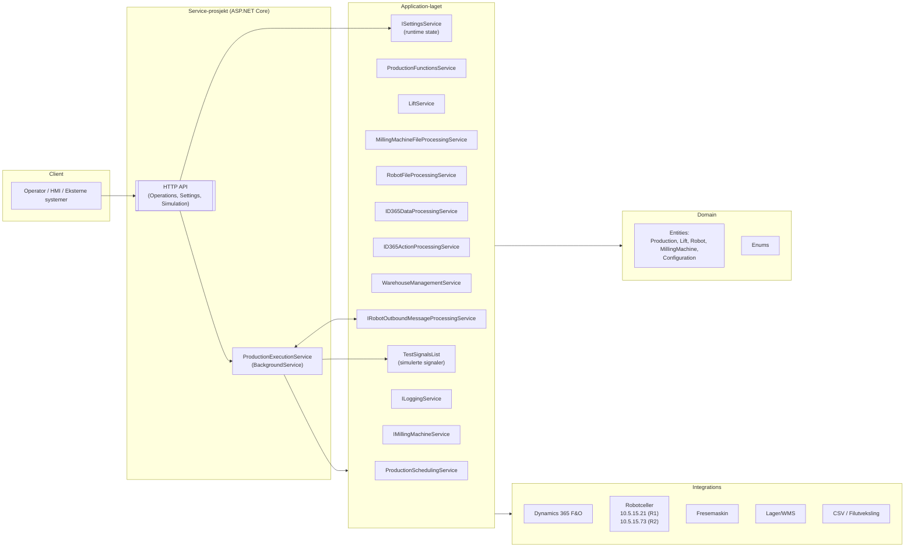
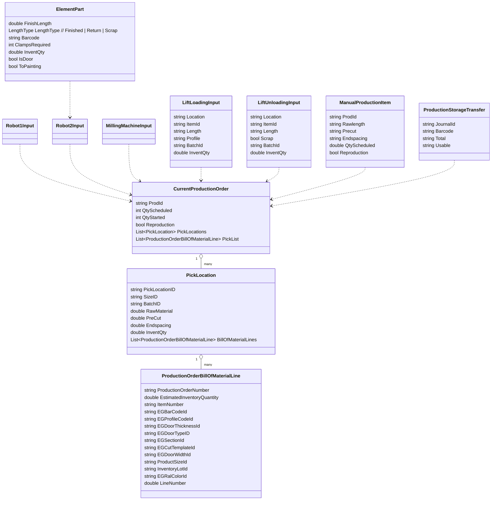

# LOB Garage Door – Produksjonskontroller

Styrer produksjonen av garasjeporter på fabrikkgulvet: plukk/lagring, løfteanlegg, fresecelle og to robotceller.
Systemet integrerer mot Dynamics 365 F&O (produksjonsordre, BOM, lager), samt roboter og fres via signaler og CSV-filer.
Kjøringen orkestreres av en ASP.NET Core-basert bakgrunnstjeneste, støttet av et HTTP API for operatørstyring.

**Status:** Utkast – oppdatert med verifiserte kilder fra denne gjennomgangen.  
**Bekreftet grunnlag (filer gjennomgått):**

Application/Services/ProductionExecutionService.cs

LOBGarageDoorProductionControllerService/Controllers/OperationsController.cs

LOBGarageDoorProductionControllerService/Controllers/SettingsController.cs

LOBGarageDoorProductionControllerService/Controllers/SimulationController.cs

Domain/Entities/Lift/LiftLoadingInput.cs, LiftUnloadingInput.cs

Domain/Entities/Production/ManualProductionItem.cs, ProductionStorageTransfer.cs

Application/Interfaces/ISettingsService.cs

Application/General/TestSignalsList.cs

Program.cs (test/debug-støtte)


## Innhold

Arkitektur

Teknologier og avhengigheter

Kjerne domenemodell

Hovedflyter

API – Endepunkter

Installasjon & kjøring

Konfigurasjon

Database

Logging & overvåkning

Tester & CI/CD

Feilsøking (kjente fallgruver)

Veikart / mangler

Bilag: Signaler som overvåkes

Bilag: Forretningsregler

Bilag: DTOer brukt i API

Eksempelflyt


## Arkitektur



### Roller og ansvar (utdrag)

ProductionExecutionService: Sentralt orkestreringsloop (2s intervall). Leser state fra ISettingsService, henter produksjonsordre (manuell/automatisk), genererer CSV-filer for Robot1/Robot2 og fresecelle, håndterer el-signal-synkronisering via IRobotOutboundMessageProcessingService.

HTTP API: Eksponerer Operations, Settings og Simulation kontrollere. Operatør-kommandoer, tilstandsendringer og testsetting.

Runtime state (Settings): Lagres i minne med ISettingsService, tilgjengelig via nøkkelbasert API. Brukes til både booleans, tellere og lister (eks: ManualProductionItems).

Testsignaler: TestSignalsList gir simulerte signaler for utvikling/test. Kontrollert via SimulationController.
Typiske signaler: DOF_OkToSendNewCsvFilesRob1, DOF_OrderDone, strLiftCommand, numElementLength.

Robot-integrasjon:

CSV-generering (via RobotFileProcessingService)

Direkte signal-/variable-skriving (via CloudToRobotHandler), krever mastership per IP.

D365-integrasjon:

Ordrehåndtering: StartProduction(...), CreatePurchaseOrder(...)

Lager: UpdateWMSLocation(...), GetPickList(...), AdjustOnHandQty(...)

Journalføring: UpdateTransferJournal(...)
## Teknologier og avhengigheter

- **.NET / ASP.NET Core**  
  Brukes til både Hosted Service (`ProductionExecutionService`) og Web API (`Controllers`).

- **Dynamics 365 F&O**  
  Integrasjon for produksjonsordre, BOM og lager.  
  Støtter operasjoner som `StartProduction`, `CreatePurchaseOrder`, `GetPickList`, `UpdateTransferJournal`, `AdjustOnHandQty`.

- **WMS (Warehouse Management System)**  
  Benyttes til å hente tray-posisjoner, sjekke beholdning og foreslå retur-lokasjoner.

- **CSV / filutveksling**  
  Robot1/Robot2 og fresemaskin mottar filer i CSV-format.  
  Format og stier settes via konfigurasjon (`RobotFileProcessingService`, `MillingMachineFileProcessingService`).

- **Digitale IO-signaler**  
  Roboter og fres kommuniserer via boolske signaler, eksponert gjennom `IRobotOutboundMessageProcessingService`.

- **Testmiljø**  
  Ved `Testing == true` brukes `TestSignalsList`, der signaler simuleres og styres via `SimulationController`.

- **Egendefinerte applikasjonstjenester**
  - `IRobotOutboundMessageProcessingService` – IO-signal mot roboter  
  - `IRobotFileProcessingService` – generering/lesing av robotfiler (CSV)  
  - `IMillingMachineFileProcessingService` – filutveksling mot fres  
  - `IMillingMachineService` – freselogikk og deling av paneler  
  - `IWarehouseManagementService` – tray- og lagerhåndtering  
  - `IProductionFunctionsService` – statusoppdateringer i produksjon  
  - `ID365DataProcessingService` – lesing av produksjonsdata fra D365  
  - `ID365ActionProcessingService` – oppretting og igangsetting av ordre  
  - `ISettingsService` – runtime state (bools, lister, konfig)  
  - `ILoggingService` – logging av hendelser

## Teknologier og avhengigheter

- **.NET / ASP.NET Core**  
  Brukes til både Hosted Service (`ProductionExecutionService`) og Web API (`Controllers`).

- **Dynamics 365 F&O**  
  Integrasjon for produksjonsordre, BOM og lager.  
  Støtter operasjoner som `StartProduction`, `CreatePurchaseOrder`, `GetPickList`, `UpdateTransferJournal`, `AdjustOnHandQty`.

- **WMS (Warehouse Management System)**  
  Benyttes til å hente tray-posisjoner, sjekke beholdning og foreslå retur-lokasjoner.

- **CSV / filutveksling**  
  Robot1/Robot2 og fresemaskin mottar filer i CSV-format.  
  Format og stier settes via konfigurasjon (`RobotFileProcessingService`, `MillingMachineFileProcessingService`).

- **Digitale IO-signaler**  
  Roboter og fres kommuniserer via boolske signaler, eksponert gjennom `IRobotOutboundMessageProcessingService`.

- **Testmiljø**  
  Ved `Testing == true` brukes `TestSignalsList`, der signaler simuleres og styres via `SimulationController`.

- **Egendefinerte applikasjonstjenester**
  - `IRobotOutboundMessageProcessingService` – IO-signal mot roboter  
  - `IRobotFileProcessingService` – generering/lesing av robotfiler (CSV)  
  - `IMillingMachineFileProcessingService` – filutveksling mot fres  
  - `IMillingMachineService` – freselogikk og deling av paneler  
  - `IWarehouseManagementService` – tray- og lagerhåndtering  
  - `IProductionFunctionsService` – statusoppdateringer i produksjon  
  - `ID365DataProcessingService` – lesing av produksjonsdata fra D365  
  - `ID365ActionProcessingService` – oppretting og igangsetting av ordre  
  - `ISettingsService` – runtime state (bools, lister, konfig)  
  - `ILoggingService` – logging av hendelser


## Kjerne domenemodell



Merk: Feltstruktur for enkelte hjelpeklasser er forenklet for oversiktens skyld.

## Hovedflyter

Systemet støtter to produksjonsmodi: **manuell** og **automatisk**.  
En sentral bakgrunnstjeneste (`ProductionExecutionService`) orkestrerer prosessen i tre hovedfaser, med 2 sekunders intervall.

---

### A) Valg av produksjon

- **Robotklar-sjekk**  
  Utføres ved å lese signalet `DOF_OkToSendNewCsvFilesRob1` fra robotcelle R1 (`10.5.15.21`).  
  I testmiljø leses verdien fra `TestSignalsList.DOF_OkToSendNewCsvFilesRob1`.

- **Manuell produksjon**  
  Dersom `Settings["ManualProductionItems"]` (type `List<List<ManualProductionItem>>`) inneholder batcher:  
  → `GetManualProduction()` henter og validerer data fra D365 og WMS.  
  Hver `ManualProductionItem` inneholder blant annet:
  - `ProdId`, `Rawlength`, `QtyScheduled`, `Reproduction`, `Location`, `Port`.

- **Automatisk produksjon**  
  Hvis `Settings["StartAutomaticExecution"] == true` og R1-signal OK:  
  → `GetProduction()` forsøker å hente neste tilgjengelige ordre.  
  Ved manglende lagerkvantum, økes `skipCount`, og systemet logger melding:  
  _"Not enough sections… Please refill storage."_

---

### B) Kjøre en ordre (`ProcessProduction`)

- **Oppdater ordrestatus i D365**  
  Utføres via `ProductionFunctionsService.UpdateProductionStatus(header, 1)`.

- **For hver PickLocation i ordren**  
  - Lagerlokasjon identifiseres (Lift1, Lift2, Kxx, Jxx...)  
  - `LiftService.CreateLiftString(...)` genererer løftekommando.  
  - `Robot1Input` bygges og skrives til CSV via `RobotFileProcessingService.CreateRobot1File(...)`.

- **Skriving av filer**  
  - Robot1: CSV genereres og sendes til angitt mappe i `appsettings.json`.  
  - Robot2 og fresefiler venter til neste fase.

---

### C) Fressecelle og Robot2 (`ProcessMillingCellData`)

- **Signal-synkronisering**  
  Utføres kun dersom signalet `DOF_OkToSendNewCsvFilesRob2 == true` (R2: `10.5.15.73`)  
  – eller `TestSignalsList.DOF_OkToSendNewCsvFilesRob2` i testmodus.

- **Panel-deling og klassifisering**  
  Panelet analyseres og deles i `ElementPart` basert på:
  - Lengde (`FinishLength`)
  - Klembehov (`ClampsRequired`)
  - Om det skal til maling (`ToPainting`)

- **Spesialregler for KASSETT-dører**  
  – Egne metoder som `CalculatePreCutKassett()` og `CalculateClampsUsed()` brukes.

- **Artikkelrester håndtering**  
  - `≥ 2400 mm` → retur til lager  
  - `1200–2399 mm` → retur (manuelt?)  
  - `< 1200 mm` → skrot

- **Dør fra rest (valgfritt)**  
  Hvis `Settings["DoorProductionInactive"] == false` og rest = 754–2399 mm →  
  → `CreateDoorProductions(...)` lager ny dørordre i D365 og starter den.

- **Skriving av filer**  
  - Fresefil: `MillingMachineFileProcessingService.CreateMillingFile(...)`  
  - Robot2-fil: `RobotFileProcessingService.CreateRobot2File(...)`

---

### D) Støtteflyter og vedlikehold

- **Løfteoperasjoner** (via API)
  - `LiftLoadingInput`, `LiftUnloadingInput` sendes fra operatør til `ISettingsService`, og prosesseres i bakgrunnen.
  - Eksempel på input: `Location`, `ItemId`, `Length`, `Profile`, `InventQty`, `Scrap`.

- **Produksjonsoverføring**  
  - `ProductionStorageTransfer` objekter legges i `Settings["ProductionStorageTransferList"]`  
  - Brukes f.eks. til retur fra fres eller intern flytting.

- **Runtime state**  
  Alle verdier og lister lagres midlertidig i `ISettingsService`.  
  API-er (`/Operations`, `/Settings`) leser og oppdaterer disse kontinuerlig.

- **Testmodus**  
  Ved `AppEnvironmentConfig.Testing == true`:  
  - Signaler og variabler styres via `SimulationController` og `TestSignalsList`.  
  - Alle produksjonsflyter kan kjøres uten fysisk tilkobling.

---

> Merk: Alle lister (`ManualProductionItems`, `LiftLoadingList`, osv.) må initialiseres som tomme ved oppstart, ellers kan `NullReferenceException` forekomme.


## API – Endepunkter

Systemet eksponerer tre hovedkontrollere: `Operations`, `Settings`, og `Simulation`.  
Alle endepunkter er HTTP-baserte (JSON inn/ut) og benytter `ISettingsService` til runtime state-håndtering.

---

### 🧭 OperationsController (`/Operations`)

| Metode | Rute                    | Body                        | Retur  | Beskrivelse                                                                 |
|--------|-------------------------|-----------------------------|--------|-----------------------------------------------------------------------------|
| POST   | /CheckReturnFeeder      | bool                        | bool   | Setter `CheckReturnFeeder`. Tjenesten prosesserer retur-feeder ved neste poll. |
| POST   | /ManualLoadingLift      | List<LiftLoadingInput>      | –      | Legger manuelle løfte-innlastinger i state.                                |
| POST   | /LoadingLiftKassett     | List<LiftLoadingInput>      | –      | Laster kassett-innlastinger.                                               |
| POST   | /ManualUnloadingLift    | List<LiftUnloadingInput>    | –      | Legger manuelle utlastinger.                                               |
| GET    | /GetFeedback            | –                           | string | Returnerer konsolidert loggtekst.                                          |
| POST   | /ManualProduction       | List<List<ManualProductionItem>> | –  | Legger en batch i køen `ManualProductionItems`.                            |
| POST   | /ProductionStorageTransfer | ProductionStorageTransfer | –      | Legger overføring i `ProductionStorageTransferList`.                       |

#### Eksempel: `/Operations/ManualProduction`
```json
[
  [
    {
      "ProdId": "116024",
      "Rawlength": "3508",
      "Precut": "2850",
      "Endspacing": "100",
      "LineNumber": "2",
      "Location": "K01AA01",
      "Port": "Port1",
      "Reproduction": false,
      "QtyScheduled": 3,
      "QtyStarted": 0
    }
  ]
]
```

Eksempel: /Operations/ManualLoadingLift
```json
[
  {
    "Location": "LIFT1",
    "ItemId": "200050",
    "ItemName": "Profil A",
    "Length": "2600",
    "Endspacing": "50",
    "Profile": "ELEGANT",
    "Select": true,
    "BatchId": "B-2025-0910",
    "InventQty": 5.0,
    "SizeId": "6000"
  }
]

```

Eksempel: /Operations/ManualUnloadingLift
```json
[
  {
    "Location": "LIFT2",
    "ItemId": "113798",
    "ItemName": "Sprosse B",
    "Length": "1800",
    "Profile": "MODERN",
    "Select": true,
    "Scrap": false,
    "BatchId": "B-2025-0905",
    "InventQty": 1.0,
    "SizeId": "5240"
  }
]
```

Eksempel: /Operations/ProductionStorageTransfer
```json
{
  "JournalId": "TRX-142076",
  "Barcode": "113798-5240",
  "Total": "5",
  "Usable": "3"
}
```

### SettingsController (`/Settings`)

| Metode | Rute                    | Body | Retur | Effekt                                                     |
|--------|-------------------------|------|-------|------------------------------------------------------------|
| POST   | /StartStop              | bool | bool  | Slår av/på automatisk kjøring (`StartAutomaticExecution`). |
| GET    | /StartStop              | –    | bool  | Leser verdien.                                             |
| POST   | /LiftInactive           | bool | bool  | Setter `LiftInactive` (ukjent hvor det brukes).            |
| GET    | /LiftInactive           | –    | bool  | Leser verdien.                                             |
| POST   | /DoorProductionInactive | bool | bool  | Slår av/på dørordre fra restlengde.                        |
| GET    | /DoorProductionInactive | –    | bool  | Leser verdien.                                             |

### SimulationController (`/Simulation`) – kun test

| Metode | Rute                          | Body   | Retur  | Beskrivelse             |
|--------|-------------------------------|--------|--------|-------------------------|
| GET    | /VariableValue/{variable}     | –      | double | Leser numerisk testvariabel. |
| POST   | /VariableValue/{variable}     | double | –      | Setter numerisk testvariabel. |
| GET    | /StringVariableValue/{variable} | –    | string | Leser strengvariabel.   |
| POST   | /StringVariableValue/{variable} | string | –     | Setter strengvariabel.  |
| GET    | /SignalValue/{signal}         | –      | bool   | Leser boolsk testsignal. |
| POST   | /SignalValue/{signal}         | bool   | –      | Setter boolsk testsignal. |

Eksempel: Sett DOF_OkToSendNewCsvFilesRob1 til true
curl -X POST http://<host>/Simulation/SignalValue/DOF_OkToSendNewCsvFilesRob1 \
-H "Content-Type: application/json" -d true

📌 Merk: Alle API-operasjoner leser/oppdaterer nøkkler i ISettingsService.
Listebaserte nøkler (ManualProductionItems, LiftLoadingList osv.) må initialiseres som tomme lister ved oppstart.

## Installasjon & kjøring

> **Ukjent:** Vi mangler `Program.cs`, `appsettings*.json` og evt. service-installasjonsskript.  
> Under er generiske steg – oppdateres når filer er tilgjengelige.

### Krav
- .NET SDK (versjon ukjent – bør spesifiseres)  
- Nettverkstilgang til robot-IP-ene: `10.5.15.21` (Robot1), `10.5.15.73` (Robot2)  
- Tilgang til D365 og WMS  

### Bygg & kjør lokalt (Service-prosjekt)
```bash
dotnet restore
dotnet build
dotnet run --project LOBGarageDoorProductionControllerService
```

## Konfigurasjon

### AppEnvironmentConfig
- `Testing` *(bool)* – styrer om `TestSignalsList` brukes i stedet for ekte IO-signaler.  

> **Ukjent:** Andre felter i `AppEnvironmentConfig` er ikke funnet i gjennomgåtte filer. Disse bør dokumenteres når de er tilgjengelige.

### ISettingsService – runtime state (brukte nøkler)

**Boolsk flagg**
- `StartAutomaticExecution`, `LiftInactive`, `DoorProductionInactive`, `CheckReturnFeeder`, `ProductionHasStarted`

**Tellere/klokker**
- `skipCount` *(int)*  
- `skipCountUpdated` *(DateTime)*  
- `ProductionCycleStart` *(DateTime)*  
- `ProductionStartTime` *(DateTime)*  
- `NumberOfDoors` *(int)*  

**Lister**
- `ManualProductionItems` : `List<List<ManualProductionItem>>`  
- `ManualLiftLoadingList` : `List<LiftLoadingInput>`  
- `LiftLoadingKassettList` : `List<LiftLoadingInput>`  
- `ManualLiftUnloadingList` : `List<LiftUnloadingInput>`  
- `ProductionStorageTransferList` : `List<ProductionStorageTransfer>`  
- `signalsToMonitor` : `List<RobotSignal>`  

> **Viktig:** Alle liste-nøkler bør initialiseres til **tomme lister** ved oppstart, for å unngå `NullReferenceException`.

### Standard signalsToMonitor (fra ProductionExecutionService)

| Robot | IP         | Signaler |
|-------|------------|----------|
| **R1** | 10.5.15.21 | DOF_ConfirmFeederReturnInPos, DOF_ActiveMessages, DOF_Port1Start, DOF_Port2Start, DOF_Port3Start, DOF_UpdatePositionData, DOF_ConfirmLeaveElement, DOF_SendLift1Command, DOF_SendLift2Command |
| **R2** | 10.5.15.73 | DOF_ConfirmLeaveFeederOut, DOF_PrintLabel, DOF_ActiveMessages, DOF_OrderStarted, DOF_OrderDone, DOF_MeasurementsConfirmed, DOF_ConfirmLeaveScrap |

### Eksempel appsettings.json
```json
{
  "AppEnvironmentConfig": {
    "Testing": true
  },
  "D365": {
    "BaseUrl": "<ukjent>",
    "Tenant": "<ukjent>",
    "ClientId": "<ukjent>",
    "ClientSecret": "<ukjent>"
  },
  "WMS": {
    "BaseUrl": "<ukjent>"
  },
  "FilePaths": {
    "Robot1CsvOut": "<ukjent>",
    "Robot2CsvOut": "<ukjent>",
    "MillingCsvOut": "<ukjent>"
  },
  "Logging": {
    "Level": "Information"
  }
}
```

## Database
> **Ukjent:** `DbContext`, migrasjoner og seed-data er ikke gjennomgått.  
> Dokumenteres når relevante filer er tilgjengelige.


## Logging & overvåkning
- `ILoggingService.LogAsync(...)` brukes gjennom hele flyten (oppstart, feil, tidsbruk).  
- `GET /Operations/GetFeedback` gir tekstlig loggutdrag.  
- **Ukjent:** Logg-sink (fil/DB/ELK), strukturert logging/tracing.


## Tester & CI/CD
> **Ukjent:** Vi har ikke sett testprosjekter eller pipeline-filer ennå.


## Feilsøking (kjente fallgruver)

- **Automatisk kjøring starter ikke:**  
  Sjekk `StartAutomaticExecution == true` og at Robot1-signal  
  `DOF_OkToSendNewCsvFiles` er `true` (10.5.15.21).

- **Filer sendes ikke til Robot2:**  
  Håndtrykk krever `DOF_OkToSendNewCsvFiles` fra Robot2 (10.5.15.73).

- **Ikke nok seksjoner i lager:**  
  Tjenesten logger *“Not enough sections… Please refill storage.”* og øker `skipCount`.

- **Null-lister i state:**  
  Initialiser alle collections i `ISettingsService` ved oppstart.

- **Test vs. produksjon:**  
  Når `Testing == true`, brukes `TestSignalsList` og `Simulation`-APIet.  
  I produksjon bør disse deaktiveres.


## Veikart / mangler
- Fullstendig API-skjema (DTO-er) for Lift/Production-objekter.  
- `appsettings`/Program/hosting (serviceinstallasjon).  
- Robot-/frese-filformater og filstier.  
- Database (`DbContext`/migrasjoner/seed).  
- Logging/tracing-opsjoner.  
- Autorisasjon og systempålogging på API.  
- Dokumentere hvor `LiftInactive` brukes i kjeden.

## Bilag: Signaler som overvåkes (eksempler)
Opprettes ved oppstart og lagres i `settings["signalsToMonitor"]` (utdrag):

- `DOF_OkToSendNewCsvFiles` (R1: 10.5.15.21, R2: 10.5.15.73)  
- `DOF_ConfirmLeaveFeederOut`, `DOF_ConfirmFeederReturnInPos`, `DOF_PrintLabel`  
- `DOF_OrderStarted`, `DOF_OrderDone`, `DOF_UpdatePositionData`, `DOF_ConfirmLeaveElement`  
- `DOF_MeasurementsConfirmed`, `DOF_ConfirmLeaveScrap`  
- Løftkommandoer: `DOF_SendLift1Command`, `DOF_SendLift2Command`

---

## Bilag: Forretningsregler (utdrag)

- **Precut**: `< 754 mm → Scrap`, `≥ 754 mm → Finished`.  
- **Rester**: `≥ 2400 mm → retur (lager)`, `1200–2399 mm → retur`, `< 1200 mm → skrot`.  
- **KASSETT-dører**: Egen precut/klemmer-rapport basert på dørtype og mål.  
- **Dør fra rest aktiv**: Hvis `DoorProductionInactive == false`; lengdemodul 754 mm.

---

## Eksempelflyt (test)

```bash
# Slå på auto og simuler at begge roboter er klare:
curl -X POST http://<host>/Settings/StartStop -H "Content-Type: application/json" -d true
curl -X POST http://<host>/Simulation/SignalValue/DOF_OkToSendNewCsvFilesRob1 -H "Content-Type: application/json" -d true
curl -X POST http://<host>/Simulation/SignalValue/DOF_OkToSendNewCsvFilesRob2 -H "Content-Type: application/json" -d true

# Legg inn en manuell batch (skjema ukjent – kun eksempel-placeholder):
curl -X POST http://<host>/Operations/ManualProduction \
  -H "Content-Type: application/json" \
  -d '[{ /* ManualProductionItem */ }]'
```
