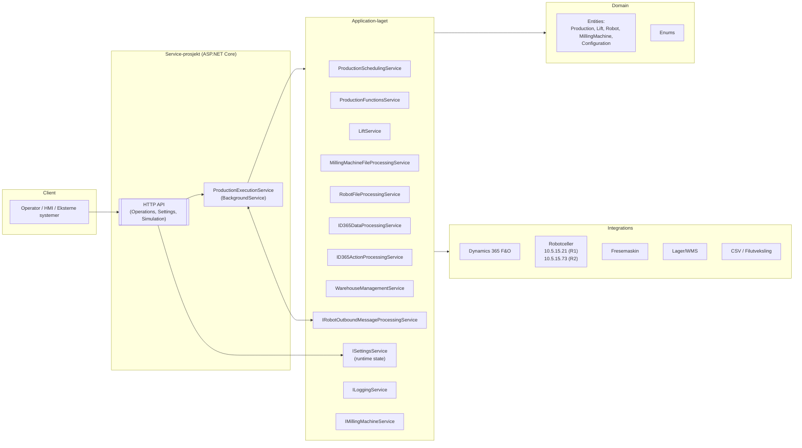

# LOB Garage Door – Produksjonskontroller

Dette repoet styrer produksjonen av garasjeporter på fabrikkgulvet: plukk/lagring, løfteanlegg, fresecelle og to robotceller. Systemet integrerer mot Dynamics 365 F&O (produksjonsordre, BOM, lager) og orkestrerer kjøringen via en bakgrunnstjeneste.

**Status:** Utkast. Basert på disse filene:
> - `Application/Services/ProductionExecutionService.cs`
> - `LOBGarageDoorProductionControllerService/Controllers/OperationsController.cs`
> - `LOBGarageDoorProductionControllerService/Controllers/SettingsController.cs`
> - `LOBGarageDoorProductionControllerService/Controllers/SimulationController.cs`

Ukjente deler er merket Ukjent og fylles inn når flere filer kommer.

## Innhold
- [Arkitektur](#arkitektur)
- [Teknologier](#teknologier)
- [Domenemodell](#domenemodell)
- [Flyter](#flyter)
- [API](#api)
- [Konfigurasjon](#konfigurasjon)
- [Feilsøking](#feilsøking)
- [Veikart](#veikart)

## Arkitektur

### Roller og ansvar (utdrag)

ProductionExecutionService: Sentralt orkestreringsloop (2s intervall). Leser state fra ISettingsService, henter produksjonsordre (manuell/automatisk), genererer filer for Robot1/Robot2 og fresecelle, håndterer håndtrykk via IO-signaler.

HTTP API: Kontroller for operatør-kommandoer (Operations), driftsmodi (Settings) og simulering i testmiljø (Simulation).

Integrasjoner:

D365 Data/Action (lese BOM/picklist, opprette/starte ordre)

WMS (plukk-/tray-posisjon, lagerkvantum)

Robot IO (digitale signaler) + CSV-filutveksling

Fresemaskin (filutveksling)
