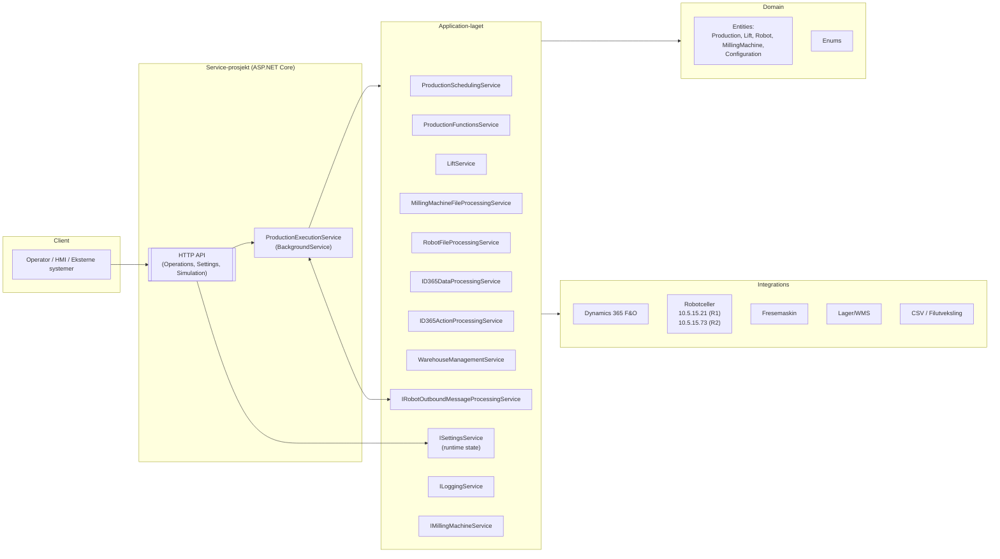
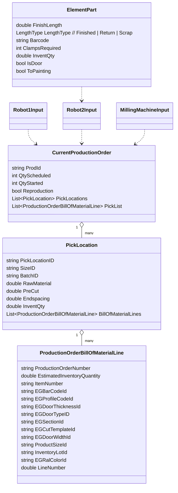

# LOB Garage Door – Produksjonskontroller

Dette repoet styrer produksjonen av garasjeporter på fabrikkgulvet: plukk/lagring, løfteanlegg, fresecelle og to robotceller. Systemet integrerer mot Dynamics 365 F&O (produksjonsordre, BOM, lager) og orkestrerer kjøringen via en bakgrunnstjeneste.

**Status:** Utkast. Basert på disse filene:
> - `Application/Services/ProductionExecutionService.cs`
> - `LOBGarageDoorProductionControllerService/Controllers/OperationsController.cs`
> - `LOBGarageDoorProductionControllerService/Controllers/SettingsController.cs`
> - `LOBGarageDoorProductionControllerService/Controllers/SimulationController.cs`

Ukjente deler er merket Ukjent og fylles inn når flere filer kommer.

## Innhold

- [Arkitektur](#arkitektur)
- [Teknologier og avhengigheter](#teknologier-og-avhengigheter)
- [Kjerne domenemodell](#kjerne-domenemodell)
- [Hovedflyter](#hovedflyter)
- [API – Endepunkter](#api--endepunkter)
- [Konfigurasjon](#konfigurasjon)
- [Feilsøking](#feilsøking)
- [Veikart](#veikart)


## Arkitektur



### Roller og ansvar (utdrag)

ProductionExecutionService: Sentralt orkestreringsloop (2s intervall). Leser state fra ISettingsService, henter produksjonsordre (manuell/automatisk), genererer filer for Robot1/Robot2 og fresecelle, håndterer håndtrykk via IO-signaler.

HTTP API: Kontroller for operatør-kommandoer (Operations), driftsmodi (Settings) og simulering i testmiljø (Simulation).

Integrasjoner:

D365 Data/Action (lese BOM/picklist, opprette/starte ordre)

WMS (plukk-/tray-posisjon, lagerkvantum)

Robot IO (digitale signaler) + CSV-filutveksling

Fresemaskin (filutveksling)

## Teknologier og avhengigheter

- **.NET / ASP.NET Core**  
  Brukes til Hosted Service (BackgroundService) og Web API (Controllers).

- **Dynamics 365 F&O**  
  Integrasjon for produksjonsordre, BOM og lager (data og handlinger).

- **Egendefinerte applikasjonstjenester**
  - `IRobotOutboundMessageProcessingService` – IO-signal mot roboter  
  - `IRobotFileProcessingService` – generering/lesing av robotfiler (CSV)  
  - `IMillingMachineFileProcessingService` – filutveksling mot fres  
  - `IMillingMachineService` – logikk knyttet til fres og kutt  
  - `IWarehouseManagementService` – håndtering av lagerplass og tray-posisjon  
  - `IProductionFunctionsService` – oppdatering av produksjonsstatus og funksjoner  
  - `ID365DataProcessingService` – lesing av BOM/picklist fra D365  
  - `ID365ActionProcessingService` – opprette og starte ordre i D365  
  - `ISettingsService` – runtime state (boolean flags, lister, konfig)  
  - `ILoggingService` – logging av hendelser

- **Konfigurasjon**
  - Via `IOptions<AppEnvironmentConfig>`  
  - Feltet **Testing** styrer om ekte signaler brukes eller `TestSignalsList` (simulering).

## Kjerne domenemodell



Merk: Eksakte felter for LiftLoadingInput, LiftUnloadingInput, ManualProductionItem, ProductionStorageTransfer er Ukjent (krever domene-filer).

## Hovedflyter

Systemet støtter to produksjonsmodi: **manuell** og **automatisk**.  
En sentral bakgrunnstjeneste (`ProductionExecutionService`) orkestrerer prosessen i tre hovedfaser:

### A) Valg av produksjon
- **Robotklar-sjekk**:  
  `IsRobot1ReadyAsync()` verifiserer signalet `DOF_OkToSendNewCsvFiles` fra robotcelle R1 (IP 10.5.15.21).  
  I testmiljø brukes `TestSignalsList.DOF_OkToSendNewCsvFilesRob1`.

- **Manuell produksjon**:  
  Dersom det finnes en batch i `Settings["ManualProductionItems"]`, hentes ordren via `GetManualProduction()` og bygges opp med data fra D365 & WMS.

- **Automatisk produksjon**:  
  Hvis `Settings["StartAutomaticExecution"] == true` → `GetProduction()` henter neste ordre fra D365.  
  Dersom lagret ikke har nok seksjoner, økes `skipCount` og det logges tydelig melding om behov for etterfylling.

### B) Kjøre en ordre (ProcessProduction)
- Start ordre i D365 ved behov:  
  `ProductionFunctionsService.UpdateProductionStatus(header, 1)`.

- For hver **PickLocation**:  
  - Bestem lager/posisjon (Lift1/Lift2/Kxx/Jxx).  
  - Beregn lift-streng via `LiftService.CreateLiftString`.  
  - Bygg `Robot1Input`.

- Skriv Robot1 CSV:  
  `RobotFileProcessingService.CreateRobot1File(...)`.

- Vent på **Robot2-klar signal** (`DOF_OkToSendNewCsvFiles`) fra robotcelle R2 (IP 10.5.15.73).  
  I testmiljø: `TestSignalsList.DOF_OkToSendNewCsvFilesRob2`.

- Gå til fressecelle: `ProcessMillingCellData`.

### C) Fressecelle / Robot2 (ProcessMillingCellData)
- Del panel i `ElementPart` (precut/finished/return/scrap) basert på mål, åpning, farge (til maling) og klemberegning (`MillingMachineService.CalculateClampsUsed`).

- **KASSETT-typer**:  
  Egen precut-beregning (`CalculatePreCutKassett` / `CalculatePreCutElegantKassett`).

- **Håndtering av rester**:
  - ≥ 2400 mm → retur til lager (store location)  
  - 1200–2399 mm → retur  
  - < 1200 mm → skrot

- **Dør fra restlengde**:  
  Hvis aktiv (dvs. `DoorProductionInactive == false`) og rester 754–2399 mm → `CreateDoorProductions` oppretter nye dørordre i D365 og starter dem.

- **Skriv filer**:  
  - Fres: `MillingMachineFileProcessingService.CreateMillingFile(...)`  
  - Robot2: `RobotFileProcessingService.CreateRobot2File(...)`

## API – Endepunkter

### OperationsController (`/Operations`)

| Metode | Rute                    | Body                        | Retur  | Beskrivelse                                                                 |
|--------|-------------------------|-----------------------------|--------|-----------------------------------------------------------------------------|
| POST   | /CheckReturnFeeder      | bool                        | bool   | Setter `CheckReturnFeeder`. Tjenesten prosesserer retur-feeder ved neste poll. |
| POST   | /ManualLoadingLift      | List<LiftLoadingInput>      | –      | Legger manuelle løfte-innlastinger i state.                                |
| POST   | /LoadingLiftKassett     | List<LiftLoadingInput>      | –      | Laster kassett-innlastinger.                                               |
| POST   | /ManualUnloadingLift    | List<LiftUnloadingInput>    | –      | Legger manuelle utlastinger.                                               |
| GET    | /GetFeedback            | –                           | string | Returnerer konsolidert loggtekst.                                          |
| POST   | /ManualProduction       | List<ManualProductionItem>  | –      | Legger en batch i køen `ManualProductionItems` (`List<List<...>>`).        |
| POST   | /ProductionStorageTransfer | ProductionStorageTransfer | –      | Legger overføring i `ProductionStorageTransferList`.                       |

**Eksempel (plassholder):**

```bash
curl -X POST http://<host>/Operations/ManualProduction \
-H "Content-Type: application/json" \
-d '[ { /* ManualProductionItem */ } ]'
```

### SettingsController (`/Settings`)

| Metode | Rute                    | Body | Retur | Effekt                                                     |
|--------|-------------------------|------|-------|------------------------------------------------------------|
| POST   | /StartStop              | bool | bool  | Slår av/på automatisk kjøring (`StartAutomaticExecution`). |
| GET    | /StartStop              | –    | bool  | Leser verdien.                                             |
| POST   | /LiftInactive           | bool | bool  | Setter `LiftInactive` (ukjent hvor det brukes).            |
| GET    | /LiftInactive           | –    | bool  | Leser verdien.                                             |
| POST   | /DoorProductionInactive | bool | bool  | Slår av/på dørordre fra restlengde.                        |
| GET    | /DoorProductionInactive | –    | bool  | Leser verdien.                                             |

### SimulationController (`/Simulation`) – kun test

| Metode | Rute                          | Body   | Retur  | Beskrivelse             |
|--------|-------------------------------|--------|--------|-------------------------|
| GET    | /VariableValue/{variable}     | –      | double | Leser numerisk testvariabel. |
| POST   | /VariableValue/{variable}     | double | –      | Setter numerisk testvariabel. |
| GET    | /StringVariableValue/{variable} | –    | string | Leser strengvariabel.   |
| POST   | /StringVariableValue/{variable} | string | –     | Setter strengvariabel.  |
| GET    | /SignalValue/{signal}         | –      | bool   | Leser boolsk testsignal. |
| POST   | /SignalValue/{signal}         | bool   | –      | Setter boolsk testsignal. |

**Typiske signaler i test:**  
`DOF_OkToSendNewCsvFilesRob1`, `DOF_OkToSendNewCsvFilesRob2`

## Installasjon & kjøring

> **Ukjent:** Vi mangler `Program.cs`, `appsettings*.json` og evt. service-installasjonsskript.  
> Under er generiske steg – oppdateres når filer er tilgjengelige.

### Krav
- .NET SDK (versjon ukjent – bør spesifiseres)  
- Nettverkstilgang til robot-IP-ene: `10.5.15.21` (Robot1), `10.5.15.73` (Robot2)  
- Tilgang til D365 og WMS  

### Bygg & kjør lokalt (Service-prosjekt)
```bash
dotnet restore
dotnet build
dotnet run --project LOBGarageDoorProductionControllerService
```

## Konfigurasjon

### AppEnvironmentConfig
- `Testing` *(bool)* – styrer om `TestSignalsList` brukes i stedet for ekte IO-signaler.  

> **Ukjent:** Andre felter i `AppEnvironmentConfig` er ikke funnet i gjennomgåtte filer. Disse bør dokumenteres når de er tilgjengelige.

### ISettingsService – runtime state (brukte nøkler)

**Boolsk flagg**
- `StartAutomaticExecution`, `LiftInactive`, `DoorProductionInactive`, `CheckReturnFeeder`, `ProductionHasStarted`

**Tellere/klokker**
- `skipCount` *(int)*  
- `skipCountUpdated` *(DateTime)*  
- `ProductionCycleStart` *(DateTime)*  
- `ProductionStartTime` *(DateTime)*  
- `NumberOfDoors` *(int)*  

**Lister**
- `ManualProductionItems` : `List<List<ManualProductionItem>>`  
- `ManualLiftLoadingList` : `List<LiftLoadingInput>`  
- `LiftLoadingKassettList` : `List<LiftLoadingInput>`  
- `ManualLiftUnloadingList` : `List<LiftUnloadingInput>`  
- `ProductionStorageTransferList` : `List<ProductionStorageTransfer>`  
- `signalsToMonitor` : `List<RobotSignal>`  

> **Viktig:** Alle liste-nøkler bør initialiseres til **tomme lister** ved oppstart, for å unngå `NullReferenceException`.

### Standard signalsToMonitor (fra ProductionExecutionService)

| Robot | IP         | Signaler |
|-------|------------|----------|
| **R1** | 10.5.15.21 | DOF_ConfirmFeederReturnInPos, DOF_ActiveMessages, DOF_Port1Start, DOF_Port2Start, DOF_Port3Start, DOF_UpdatePositionData, DOF_ConfirmLeaveElement, DOF_SendLift1Command, DOF_SendLift2Command |
| **R2** | 10.5.15.73 | DOF_ConfirmLeaveFeederOut, DOF_PrintLabel, DOF_ActiveMessages, DOF_OrderStarted, DOF_OrderDone, DOF_MeasurementsConfirmed, DOF_ConfirmLeaveScrap |

### Eksempel appsettings.json
```json
{
  "AppEnvironmentConfig": {
    "Testing": true
  },
  "D365": {
    "BaseUrl": "<ukjent>",
    "Tenant": "<ukjent>",
    "ClientId": "<ukjent>",
    "ClientSecret": "<ukjent>"
  },
  "WMS": {
    "BaseUrl": "<ukjent>"
  },
  "FilePaths": {
    "Robot1CsvOut": "<ukjent>",
    "Robot2CsvOut": "<ukjent>",
    "MillingCsvOut": "<ukjent>"
  },
  "Logging": {
    "Level": "Information"
  }
}
```

## Database
> **Ukjent:** `DbContext`, migrasjoner og seed-data er ikke gjennomgått.  
> Dokumenteres når relevante filer er tilgjengelige.


## Logging & overvåkning
- `ILoggingService.LogAsync(...)` brukes gjennom hele flyten (oppstart, feil, tidsbruk).  
- `GET /Operations/GetFeedback` gir tekstlig loggutdrag.  
- **Ukjent:** Logg-sink (fil/DB/ELK), strukturert logging/tracing.


## Tester & CI/CD
> **Ukjent:** Vi har ikke sett testprosjekter eller pipeline-filer ennå.


## Feilsøking (kjente fallgruver)

- **Automatisk kjøring starter ikke:**  
  Sjekk `StartAutomaticExecution == true` og at Robot1-signal  
  `DOF_OkToSendNewCsvFiles` er `true` (10.5.15.21).

- **Filer sendes ikke til Robot2:**  
  Håndtrykk krever `DOF_OkToSendNewCsvFiles` fra Robot2 (10.5.15.73).

- **Ikke nok seksjoner i lager:**  
  Tjenesten logger *“Not enough sections… Please refill storage.”* og øker `skipCount`.

- **Null-lister i state:**  
  Initialiser alle collections i `ISettingsService` ved oppstart.

- **Test vs. produksjon:**  
  Når `Testing == true`, brukes `TestSignalsList` og `Simulation`-APIet.  
  I produksjon bør disse deaktiveres.


## Veikart / mangler
- Fullstendig API-skjema (DTO-er) for Lift/Production-objekter.  
- `appsettings`/Program/hosting (serviceinstallasjon).  
- Robot-/frese-filformater og filstier.  
- Database (`DbContext`/migrasjoner/seed).  
- Logging/tracing-opsjoner.  
- Autorisasjon og systempålogging på API.  
- Dokumentere hvor `LiftInactive` brukes i kjeden.

## Bilag: Signaler som overvåkes (eksempler)
Opprettes ved oppstart og lagres i `settings["signalsToMonitor"]` (utdrag):

- `DOF_OkToSendNewCsvFiles` (R1: 10.5.15.21, R2: 10.5.15.73)  
- `DOF_ConfirmLeaveFeederOut`, `DOF_ConfirmFeederReturnInPos`, `DOF_PrintLabel`  
- `DOF_OrderStarted`, `DOF_OrderDone`, `DOF_UpdatePositionData`, `DOF_ConfirmLeaveElement`  
- `DOF_MeasurementsConfirmed`, `DOF_ConfirmLeaveScrap`  
- Løftkommandoer: `DOF_SendLift1Command`, `DOF_SendLift2Command`

---

## Bilag: Forretningsregler (utdrag)

- **Precut**: `< 754 mm → Scrap`, `≥ 754 mm → Finished`.  
- **Rester**: `≥ 2400 mm → retur (lager)`, `1200–2399 mm → retur`, `< 1200 mm → skrot`.  
- **KASSETT-dører**: Egen precut/klemmer-rapport basert på dørtype og mål.  
- **Dør fra rest aktiv**: Hvis `DoorProductionInactive == false`; lengdemodul 754 mm.

---

## Eksempelflyt (test)

```bash
# Slå på auto og simuler at begge roboter er klare:
curl -X POST http://<host>/Settings/StartStop -H "Content-Type: application/json" -d true
curl -X POST http://<host>/Simulation/SignalValue/DOF_OkToSendNewCsvFilesRob1 -H "Content-Type: application/json" -d true
curl -X POST http://<host>/Simulation/SignalValue/DOF_OkToSendNewCsvFilesRob2 -H "Content-Type: application/json" -d true

# Legg inn en manuell batch (skjema ukjent – kun eksempel-placeholder):
curl -X POST http://<host>/Operations/ManualProduction \
  -H "Content-Type: application/json" \
  -d '[{ /* ManualProductionItem */ }]'
```
